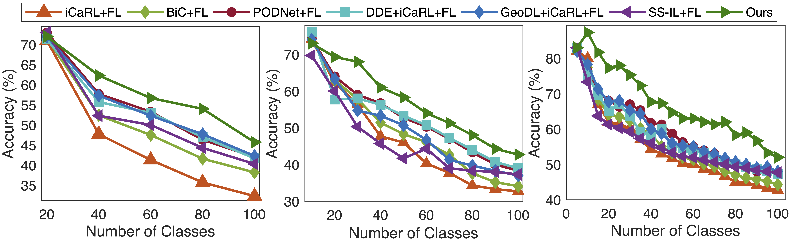
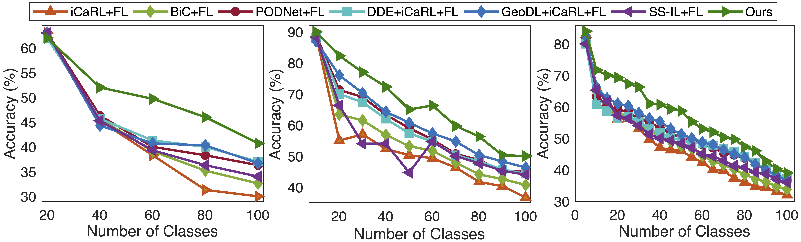

# Official PyTorch Implementation for GLFC

# [CVPR 2022 Federated Class-Incremental Learning](https://arxiv.org/abs/2203.11473)

# This is the official implementation code of CVPR 2022 paper 'Federated Class-Incremental Learning'. 

You can find the arxiv version at [here](https://arxiv.org/abs/2203.11473).


## requirement

python == 3.6

torch == 1.2.0

numpy

PIL

torchvision == 0.4.0

cv2

scipy == 1.5.2

sklearn == 0.24.1


## pre-preparations

#### CIFAR100

You don't need to do anything before running the experiments of CIFAR100.

#### Mini-Imagenet (Imagenet-Subset)

You need to download the Mini-Imagenet from [here](https://github.com/yaoyao-liu/mini-imagenet-tools) and place it in './train'.

#### Tiny-Imagenet

You need to download the Tiny-Imagenet from [here](https://github.com/seshuad/IMagenet) and place it in './tiny-imagenet-200'.


## run

```shell
python fl_main.py
```

The detailed arguments can be found in './src/option.py'.

## performance

#### CIFAR100



#### Mini-Imagenet (Imagenet-Subset)




## cite

If you find our work is helpful to your research, please consider to cite.

```
@InProceedings{dong2022federated,
    author = {Dong, Jiahua and Wang, Lixu and Fang, Zhen and Sun, Gan and Xu, Shichao and Wang, Xiao and Zhu, Qi},
    title = {Federated Class-Incremental Learning},
    booktitle = {IEEE/CVF Conference on Computer Vision and Pattern Recognition (CVPR)},
    month = {June},
    year = {2022},
}
```


